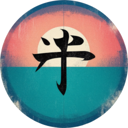
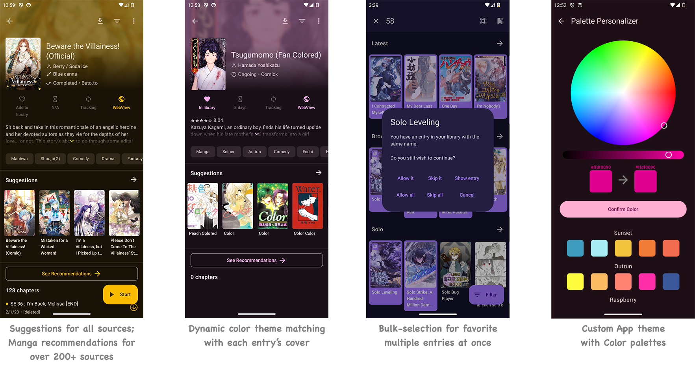

# Anikku [App](#)

### Full-featured player, based on Aniyomi.
Discover and watch anime, cartoons, series, and more – easier than ever on your Android device.

| Releases | Preview |
|----------|---------|
| 
    | 
    |

## Download

*Requires Android 8.0 or higher.*

## Features

Features include:

* **Anikku**:
  * `Anime Suggestions` automatically showing source-website's recommendations / suggestions / related to current entry for all sources.
  * `Auto theme color` based on each entry's cover for entry View & Reader.
  * `App custom theme` with `Color palettes` for endless color lover.
  * `Bulk-favorite` multiple entries all at once.
  * `Fast browsing` (for who with large library experiencing slow loading)
  * Auto `2-way sync` progress with trackers.
  * From SY:
    * `Anime Recommendations` showing community recommends from Anilist, MyAnimeList.
    * Edit `Anime Info` manually, or fill data from MyAnimeList, Kitsu, Shikimori, Bangumi, Simkl.
    * `Custom cover` with files or URL.
    * `Feed tab`, where you can easily view the latest entries or saved search from multiple sources at same time.
    * `Saving searches` & filters, can use them with `Feed-tab`
    * `Pin anime` to top of Library with `Tag` sort.
    * `Merge anime` allow merging separated anime/episodes into one entry.
    * `Lewd filter`, hide the lewd anime in your library when you want to.
    * `Tracking filter`, filter your tracked anime so you can see them or see non-tracked anime.
    * `Search tracking` status in library.
    * `Mass-migration` all your anime from one source to another at same time.
    * `Dynamic Categories`, view the library in multiple ways.
    * `Custom categories` for sources, liked the pinned sources, but you can make your own versions and put any sources in them.
    * Cross device `Library sync` with SyncYomi & Google Drive.
  * Anime `cover on Updates notification`.
  * `Panorama cover` showing wide cover in full.
  * `to-be-updated` screen: which entries are going to be checked with smart-update?
  * `Update Error` screen & migrating them away.
  * `Source & Language icon` on Library & various places. (Some language flags are not really accurate)
  * `Grouped updates` in Update tab (inspired by J2K).
  * Drag & Drop re-order `Categories`.
  * Ability to `enable/disable repo`, with icon.
  * `Search for sources` & Quick NSFW sources filter in Extensions, Browse & Migration screen.
  * In-app `progress banner` shows Library syncing / Backup restoring / Library updating progress.
  * Long-click to add/remove single entry to/from library, everywhere.
  * Docking Watch/Resume button to left/right.
  * Auto-install app update.
  * Configurable interval to refresh entries from downloaded storage.
  * And many more from same maintainer's app for Manga reader: [Komikku](https://github.com/komikku-app/komikku)
* Animetail:
  * Support for Cast functionality
  * Support themes monet
  * Android tv compatibility (only banner)
  * Optimized Discord Rich Presence for Manga and Anime, no external API.
* Kuukiyomi:
  * Torrent support(Needs right extensions) (@Diegopyl1209)
  * Custom Theme support
  * resmush.it(Data Saver Provider)
  * Group by tags in library
  * Discord Rich Presence for Manga
* Aniyomi:
  * Watching videos
  * Local watching of downloaded content
  * A configurable player built on mpv-android with multiple options and settings
  * Tracker support: [MyAnimeList](https://myanimelist.net/), [AniList](https://anilist.co/), [Kitsu](https://kitsu.app/), [Simkl](https://simkl.in/), [Shikimori](https://shikimori.one), and [Bangumi](https://bgm.tv/)
  * Categories to organize your library
  * Light and dark themes
  * Create backups locally to watch offline or to your desired cloud service
* Other fork features:
  * Animiru:
    * Discord Rich Presence

# Issues, Feature Requests and Contributing

Pull requests are welcome. For major changes, please open an issue first to discuss what you would like to change.

Issues

1. **Before reporting a new issue, take a look at the [FAQ](https://mihon.app/docs/faq/general), the [changelog](https://github.com/komikku-app/anikku/releases) and the already opened [issues](https://github.com/komikku-app/anikku/issues).**
2. If you are unsure, ask here: 

Bugs

* Include version (More → About → Version)
 * If not latest, try updating, it may have already been solved
 * Preview version is equal to the number of commits as seen on the main page
* Include steps to reproduce (if not obvious from description)
* Include screenshot (if needed)
* If it could be device-dependent, try reproducing on another device (if possible)
* Don't group unrelated requests into one issue

Use the [issue forms](https://github.com/komikku-app/anikku/issues/new/choose) to submit a bug.

Feature Requests

* Write a detailed issue, explaining what it should do or how.
* Include screenshot (if needed).

Contributing

See [CONTRIBUTING.md](./CONTRIBUTING.md).

Code of Conduct

See [CODE_OF_CONDUCT.md](./CODE_OF_CONDUCT.md).

### Credits

Thank you to all the people who have contributed!

### Disclaimer

The developer(s) of this application does not have any affiliation with the content providers available, and this application hosts zero content.

## FAQ

* Anikku [website](https://anikku-app.github.io/) / [Discord](https://discord.gg/85jB7V5AJR)

* Aniyomi [website](https://aniyomi.org/) / [Discord](https://discord.gg/F32UjdJZrR)

### License

<pre>
Copyright © 2015 Javier Tomás
Copyright © 2024 The Mihon Open Source Project
Copyright © 2024 The Aniyomi Open Source Project

Licensed under the Apache License, Version 2.0 (the "License");
you may not use this file except in compliance with the License.
You may obtain a copy of the License at

http://www.apache.org/licenses/LICENSE-2.0

Unless required by applicable law or agreed to in writing, software
distributed under the License is distributed on an "AS IS" BASIS,
WITHOUT WARRANTIES OR CONDITIONS OF ANY KIND, either express or implied.
See the License for the specific language governing permissions and
limitations under the License.
</pre>

